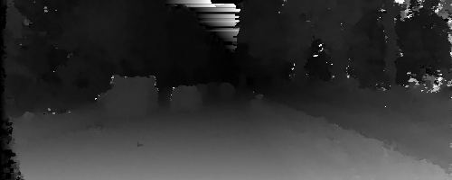

## EDLSM

This is a Pytorch implementation for stereo matching described in the paper: [Efficient Deep learning for stereo matching](https://www.cs.toronto.edu/~urtasun/publications/luo_etal_cvpr16.pdf)

### Sample Output


### Prerequisites
1. Pytorch Version --v0.4 with CUDA > 8.0
2. Numpy --v1.14
3. OpenCV --v3.2
4. Matplotlib --v2.1

### Preparing training and validation data
First we need to generate the valid pixel locations.

1. Download the [KITTI 2015](http://www.cvlibs.net/datasets/kitti/eval_scene_flow.php?benchmark=stereo) dataset.
2. Go to the cloned EDLSM folder and run the following command:
``` bash
mkdir dataset

python prepare_kitti_dataset.py  --dataset_dir=/path/to/data_scene_flow/training --dump_root=./dataset
```

**Note:**  In order to see other changeable parameters such as patch size, image height/width, train/val split etc, run the following command:
``` bash
python prepare_kitti_dataset.py  --h
```

### Training
Once the data is successfully prepared, the model can be trained by running the following command:
```bash
python train.py --dataset_dir=/path/to/data_scene_flow/training --train_dataset_name=tr_160_18_100.txt --checkpoint_dir=/where/to/store/checkpoints
```

**Note:**  In order to see other changeable parameters such as batch size, image height/width, pixel weights, etc., run the following command:
``` bash
python prepare_kitti_dataset.py  --h
```

In order to see the training loss graph open a  `tensorboard` session by
```bash
tensorboard --logdir=./logs --port 8080
```

### Inference
Once model is trained, we can generate disparity map by running the following command:
```bash
python inference_match.py --dataset_dir=/path/to/data_scene_flow/training --checkpoint_dir=/where/checkpoints/stored --checkpoint_file=eldsm_38000 --test_num=82
```

**Note:**  In order to see other changeable parameters such as image height/width,disparity range, etc, run the following command:
``` bash
python inference_match.py  --h
```
### Future Work
Implement the post-processing steps.

### Code citation
Original Code: https://bitbucket.org/saakuraa/cvpr16_stereo_public

Pytorch  Code: https://github.com/vijaykumar01/stereo_matching
### Paper citation
```
@inproceedings{luo2016efficient,
  title={Efficient deep learning for stereo matching},
  author={Luo, Wenjie and Schwing, Alexander G and Urtasun, Raquel},
  booktitle={Proceedings of the IEEE Conference on Computer Vision and Pattern Recognition},
  pages={5695--5703},
  year={2016}
}
```
